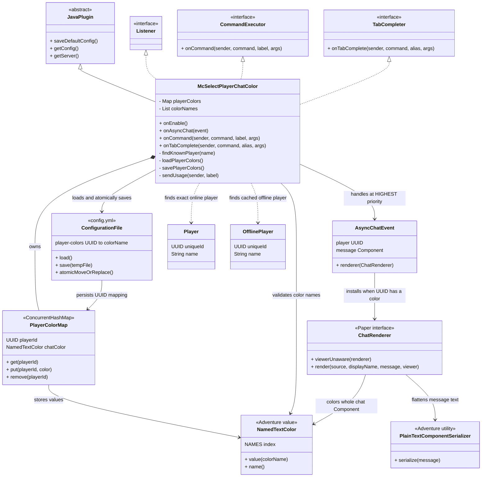

# mc-select-player-chat-color

为 Paper 服务器中的指定玩家设置原版聊天颜色。设置后，玩家发送的整条聊天内容，包括 `<玩家名>` 与消息正文，都会使用同一种颜色。

## 使用方法

OP 或拥有 `mc-select-player-chat-color.admin` 权限的管理员可以执行：

```text
/mc-select-player-chat-color <玩家> <颜色|reset>
```

示例：

```text
/mc-select-player-chat-color rainyxin yellow
/mc-select-player-chat-color rainyxin dark_aqua
/mc-select-player-chat-color rainyxin reset
```

在线玩家可直接设置。离线玩家必须已经被当前服务端缓存，以确保颜色绑定到正确的 UUID。`reset` 会恢复该玩家的默认聊天样式。

支持全部 16 种原版命名颜色：

```text
black, dark_blue, dark_green, dark_aqua, dark_red, dark_purple, gold, gray,
dark_gray, blue, green, aqua, red, light_purple, yellow, white
```

## 工作原理



颜色映射由 UUID 而非玩家名保存，因此玩家改名后仍会保留已设置的聊天颜色。

## 环境与构建

本项目面向 Paper `26.2.build.87-stable` 与 Java 25，使用 Paper 的 `AsyncChatEvent` 和 `ChatRenderer`。不保证旧版 Paper、Spigot 或 Purpur 的兼容性。

```bash
mvn clean package
```

构建产物为 `target/mc-select-player-chat-color-1.0.0.jar`。将它放入服务器的 `plugins/` 目录后重启服务器即可加载。
